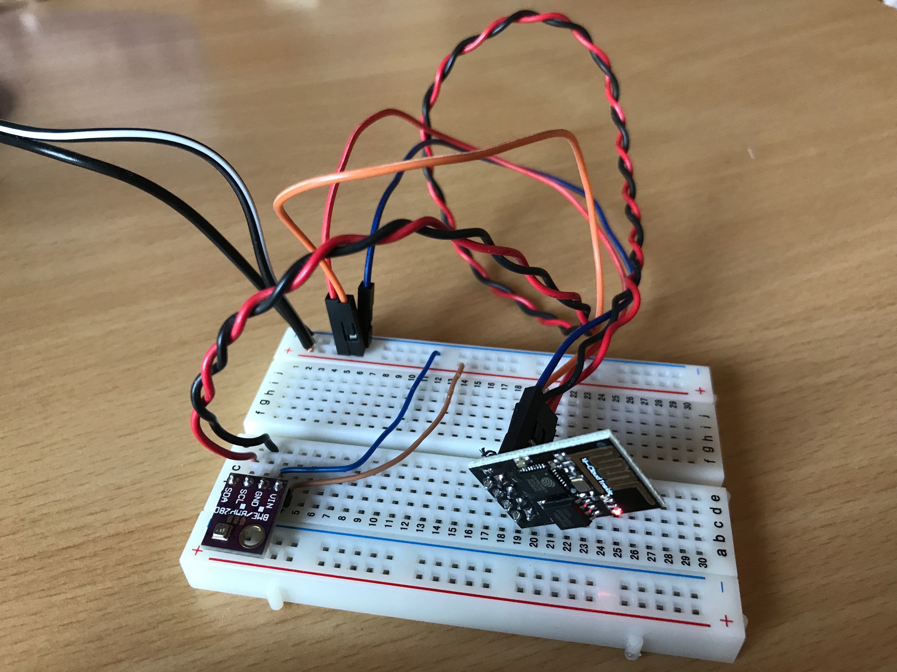

# espthp

A sketch for ESP8266 ESP-01
It enables the ESP8266 to connect to WiFi and send data from BME/BMP280 to an MQTT server.

## connections

Reset pin is high (with 10-12k resistor) and pulled low for reset.  
ESP.GPIO0 is pulled low for programming.

After uploading the sketch:  
ESP.GPIO0 is connected to BME280.SDA  
ESP.GPIO2 is connected to BME280.SCL

## pre-upload

create a file called config.h containing:

```sh
#define WIFI_SSID "<wifi-name>"
#define WIFI_PASS "<wifi-password>""
#define MQTT_IP "192.168.0.107"
#define MQTT_PORT 1883
```

## MQTT channels

The following channels are used.

```
raw/chipId/status
raw/chipId/temperature
raw/chipId/humidity
raw/chipId/pressure
```

All data is sent to a `raw` tree using the chipId of ESP.
The status is retained, set to online when ESP connects and
set by mqtt broker to 'disconnected' when
no response from ESP was had for some period of time.

## Picture

Test setup after uploading (without serial connection).


